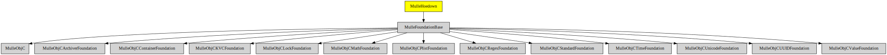

# MulleHoedown

#### 💃🏼 Markdown support for mulle-objc


Converts [markdown](https://en.wikipedia.org/wiki/Markdown) to HTML.


| Release Version                                       | Release Notes
|-------------------------------------------------------|--------------
|  [](//github.com//MulleHoedown/actions)| [RELEASENOTES](RELEASENOTES.md) |


## API

MulleHowdown adds the following conversion method to **NSString**:

``` objc
- (NSString *) hoedownedString;
```

and adds the following conversion method to **NSData**:

``` objc
- (NSData *) hoedownedData;
```


## Overview


| Requirement                                  | Description
|----------------------------------------------|-----------------------
| [MulleFoundationBase](https://github.com/MulleFoundation/MulleFoundationBase)             | 🛸 MulleFoundationBase does something
| [mulle-objc-list](https://github.com/mulle-objc/mulle-objc-list)             | 📒 Lists mulle-objc runtime information contained in executables.


## Add

Use [mulle-sde](//github.com/mulle-sde) to add MulleHoedown to your project:

``` sh
mulle-sde add github:MulleWeb/MulleHoedown
```

## Install

### Install with mulle-sde

Use [mulle-sde](//github.com/mulle-sde) to build and install MulleHoedown and all dependencies:

``` sh
mulle-sde install --prefix /usr/local \
   https://github.com//MulleHoedown/archive/latest.tar.gz
```

### Manual Installation

Install the requirements:

| Requirements                                 | Description
|----------------------------------------------|-----------------------
| [MulleFoundationBase](https://github.com/MulleFoundation/MulleFoundationBase)             | 🛸 MulleFoundationBase does something
| [mulle-objc-list](https://github.com/mulle-objc/mulle-objc-list)             | 📒 Lists mulle-objc runtime information contained in executables.

Download the latest [tar](https://github.com/MulleWeb/MulleHoedown/archive/refs/tags/latest.tar.gz) or [zip](https://github.com/MulleWeb/MulleHoedown/archive/refs/tags/latest.zip) archive and unpack it.

Install **MulleHoedown** into `/usr/local` with [cmake](https://cmake.org):

``` sh
cmake -B build \
      -DCMAKE_INSTALL_PREFIX=/usr/local \
      -DCMAKE_PREFIX_PATH=/usr/local \
      -DCMAKE_BUILD_TYPE=Release &&
cmake --build build --config Release &&
cmake --install build --config Release
```

## Platforms and Compilers

All platforms and compilers supported by
[mulle-c11](//github.com/mulle-c/mulle-c11).


## Author

[Nat!](https://mulle-kybernetik.com/weblog) for Mulle kybernetiK

